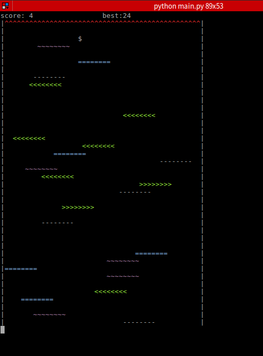
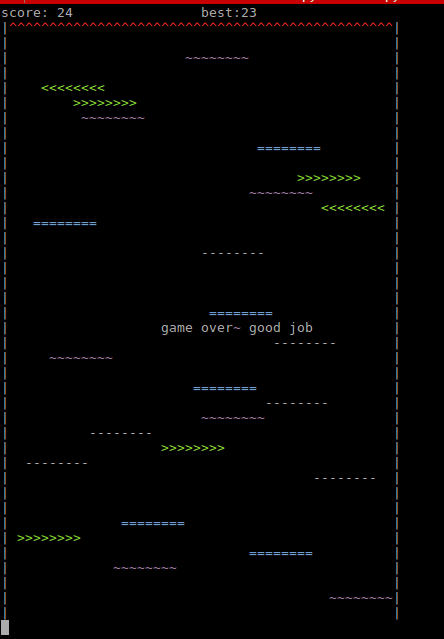

# pyman

最近又想折腾点"游戏"相关的，想搞个RL（Reinforcement Learning）的AI

然后前两天修仙时看到这个http://www.bilibili.com/blackboard/activity-61dungeon.html，于是就决定了

当前版本(限Linux)，游戏基本完成(配色有毒欢迎修改)，开始构思AI部分～

游戏介绍

- python main.py 运行游戏
- $ 为控制的人物，不能碰到顶上的^
- -\-\-\-\- 为普通石板 
- =====为弹跳石板
- \~\~\~\~\~为易碎石板
- <<<< 与 >>>>>> 分别是向左和向右的传送带
- A/a 移动向左 D/d 向右 （建议不要按住按键，一下下的点击才好控制）
- Esc 中止游戏

